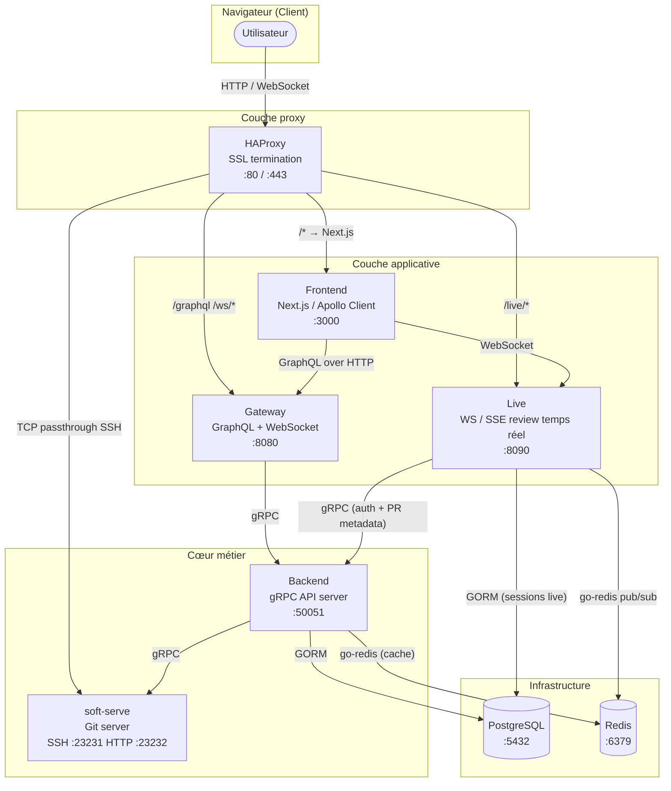
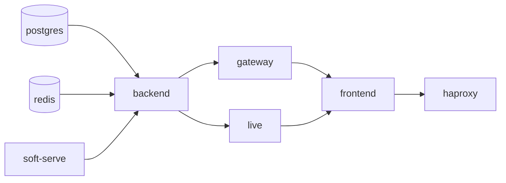

# Architecture globale — GYT

## Vue d'ensemble (C4 niveau 2 — Container)

---

## Séparation des responsabilités

| Service    | Ce qu'il fait                                              | Ce qu'il ne fait PAS                              |
|------------|------------------------------------------------------------|---------------------------------------------------|
| `frontend` | Rendu UI, routing, Apollo cache                            | Aucune logique métier, aucun accès DB direct      |
| `gateway`  | Traduction GraphQL ↔ gRPC, validation JWT                  | Aucun état, aucun accès DB                        |
| `live`     | Synchronisation curseurs/commentaires en temps réel        | Aucune opération git                              |
| `backend`  | Toute la logique métier (users, repos, PRs, issues, orgs)  | Pas d'HTTP public, pas de WebSocket               |
| `soft-serve` | Stockage et service des dépôts git                       | Pas de logique applicative                        |

---

## Ordre de démarrage (health checks Docker Compose)

Le backend réessaie la connexion à soft-serve jusqu'à 5 fois — une lenteur au démarrage du conteneur n'est pas bloquante.

---

## Tableau des protocoles

| Émetteur   | Destinataire | Protocole           | Raison                                          |
|------------|--------------|---------------------|-------------------------------------------------|
| Frontend   | Gateway      | GraphQL / HTTP      | Interface typée et flexible pour l'UI           |
| Frontend   | Gateway      | WebSocket           | Subscriptions (événements repo/PR)              |
| Frontend   | Live         | WebSocket / SSE     | Collaboration review en temps réel              |
| Gateway    | Backend      | gRPC                | Transport binaire, contrat fort, perf           |
| Live       | Backend      | gRPC                | Vérification auth et métadonnées PR             |
| Backend    | soft-serve   | gRPC                | Gestion des dépôts git                          |
| Backend    | Redis        | go-redis            | Cache lectures DB et soft-serve                 |
| Live       | Redis        | go-redis pub/sub    | Diffusion événements multi-instances            |
| Backend    | PostgreSQL   | GORM                | Persistance primaire                            |
| Live       | PostgreSQL   | GORM                | Sessions live, participants, messages           |
