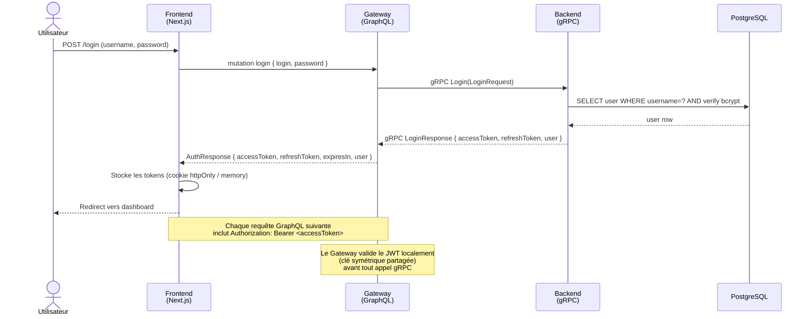
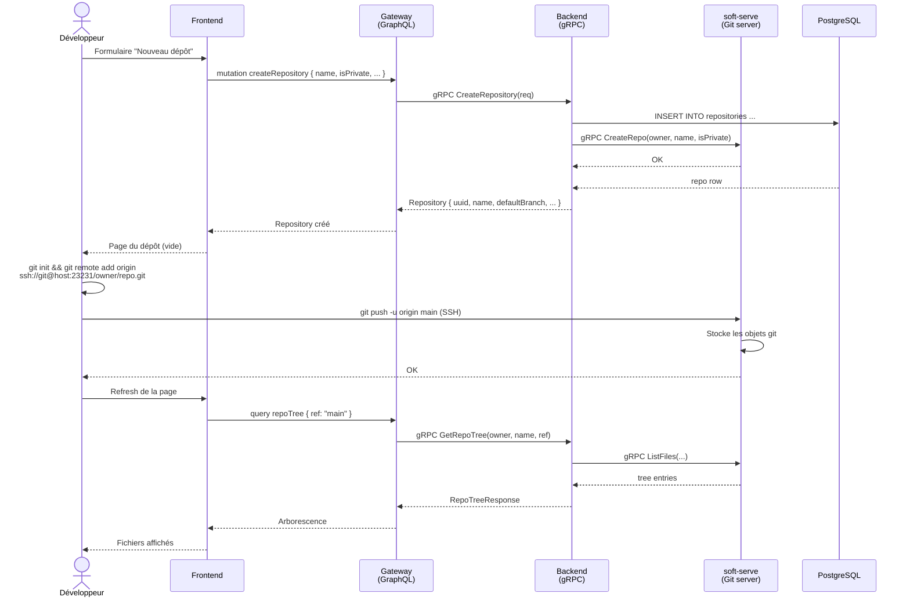
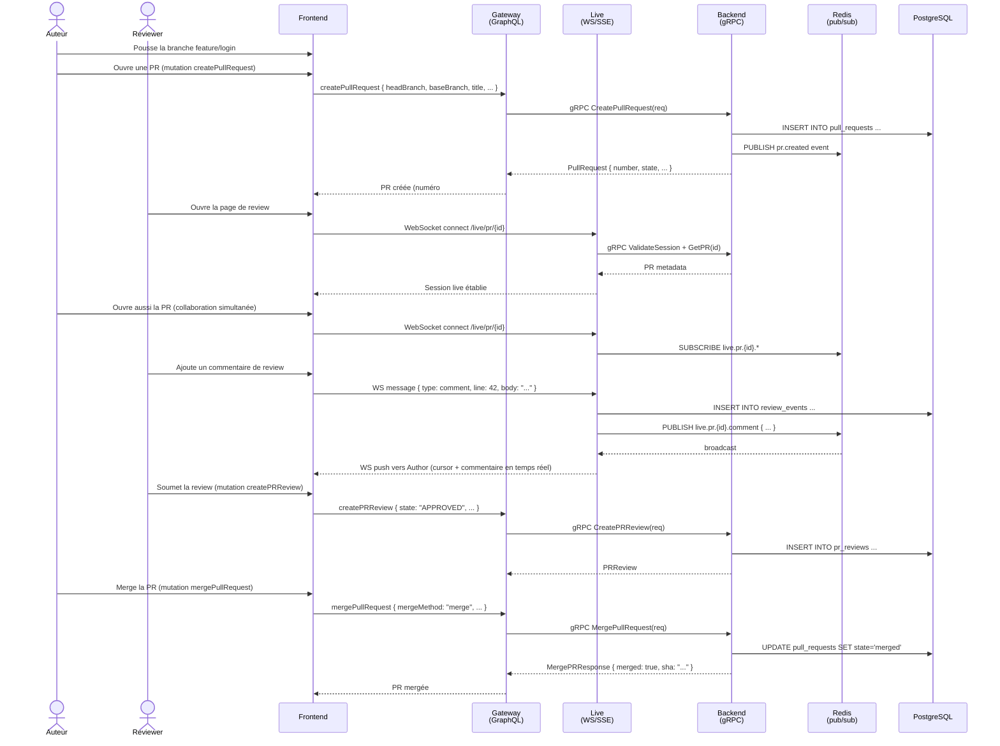
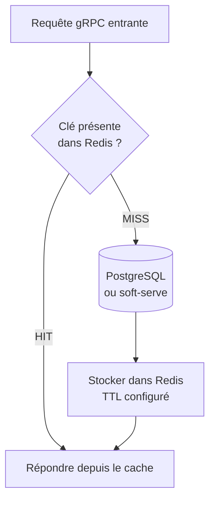

# Diagrammes de flux — GYT

## 1. Authentification JWT

```mermaid
sequenceDiagram
    actor U as Utilisateur
    participant FE as Frontend<br/>(Next.js)
    participant GW as Gateway<br/>(GraphQL)
    participant BE as Backend<br/>(gRPC)
    participant PG as PostgreSQL

    U->>FE: POST /login (username, password)
    FE->>GW: mutation login { login, password }
    GW->>BE: gRPC Login(LoginRequest)
    BE->>PG: SELECT user WHERE username=? AND verify bcrypt
    PG-->>BE: user row
    BE-->>GW: gRPC LoginResponse { accessToken, refreshToken, user }
    GW-->>FE: AuthResponse { accessToken, refreshToken, expiresIn, user }
    FE->>FE: Stocke les tokens (cookie httpOnly / memory)
    FE-->>U: Redirect vers dashboard

    Note over FE,GW: Chaque requête GraphQL suivante<br/>inclut Authorization: Bearer <accessToken>
    Note over GW: Le Gateway valide le JWT localement<br/>(clé symétrique partagée)<br/>avant tout appel gRPC
```

---

## 2. Création d'un dépôt et premier push git

```mermaid
sequenceDiagram
    actor Dev as Développeur
    participant FE as Frontend
    participant GW as Gateway<br/>(GraphQL)
    participant BE as Backend<br/>(gRPC)
    participant SS as soft-serve<br/>(Git server)
    participant PG as PostgreSQL

    Dev->>FE: Formulaire "Nouveau dépôt"
    FE->>GW: mutation createRepository { name, isPrivate, ... }
    GW->>BE: gRPC CreateRepository(req)

    BE->>PG: INSERT INTO repositories ...
    BE->>SS: gRPC CreateRepo(owner, name, isPrivate)
    SS-->>BE: OK
    PG-->>BE: repo row
    BE-->>GW: Repository { uuid, name, defaultBranch, ... }
    GW-->>FE: Repository créé
    FE-->>Dev: Page du dépôt (vide)

    Dev->>Dev: git init && git remote add origin<br/>ssh://git@host:23231/owner/repo.git
    Dev->>SS: git push -u origin main (SSH)
    SS->>SS: Stocke les objets git
    SS-->>Dev: OK

    Dev->>FE: Refresh de la page
    FE->>GW: query repoTree { ref: "main" }
    GW->>BE: gRPC GetRepoTree(owner, name, ref)
    BE->>SS: gRPC ListFiles(...)
    SS-->>BE: tree entries
    BE-->>GW: RepoTreeResponse
    GW-->>FE: Arborescence
    FE-->>Dev: Fichiers affichés
```

---

## 3. Cycle de vie d'une Pull Request

```mermaid
sequenceDiagram
    actor Author as Auteur
    actor Rev as Reviewer
    participant FE as Frontend
    participant GW as Gateway<br/>(GraphQL)
    participant LV as Live<br/>(WS/SSE)
    participant BE as Backend<br/>(gRPC)
    participant RD as Redis<br/>(pub/sub)
    participant PG as PostgreSQL

    Author->>FE: Pousse la branche feature/login
    Author->>FE: Ouvre une PR (mutation createPullRequest)
    FE->>GW: createPullRequest { headBranch, baseBranch, title, ... }
    GW->>BE: gRPC CreatePullRequest(req)
    BE->>PG: INSERT INTO pull_requests ...
    BE->>RD: PUBLISH pr.created event
    BE-->>GW: PullRequest { number, state, ... }
    GW-->>FE: PR créée (numéro #1)

    Rev->>FE: Ouvre la page de review
    FE->>LV: WebSocket connect /live/pr/{id}
    LV->>BE: gRPC ValidateSession + GetPR(id)
    BE-->>LV: PR metadata
    LV-->>FE: Session live établie

    Author->>FE: Ouvre aussi la PR (collaboration simultanée)
    FE->>LV: WebSocket connect /live/pr/{id}
    LV->>RD: SUBSCRIBE live.pr.{id}.*

    Rev->>FE: Ajoute un commentaire de review
    FE->>LV: WS message { type: comment, line: 42, body: "..." }
    LV->>PG: INSERT INTO review_events ...
    LV->>RD: PUBLISH live.pr.{id}.comment { ... }
    RD-->>LV: broadcast
    LV-->>FE: WS push vers Author (cursor + commentaire en temps réel)

    Rev->>FE: Soumet la review (mutation createPRReview)
    FE->>GW: createPRReview { state: "APPROVED", ... }
    GW->>BE: gRPC CreatePRReview(req)
    BE->>PG: INSERT INTO pr_reviews ...
    BE-->>GW: PRReview

    Author->>FE: Merge la PR (mutation mergePullRequest)
    FE->>GW: mergePullRequest { mergeMethod: "merge", ... }
    GW->>BE: gRPC MergePullRequest(req)
    BE->>PG: UPDATE pull_requests SET state='merged'
    BE-->>GW: MergePRResponse { merged: true, sha: "..." }
    GW-->>FE: PR mergée
```

---

## 4. Flux de cache Redis (backend)

```mermaid
flowchart TD
    REQ[Requête gRPC entrante] --> CHK{Clé présente<br/>dans Redis ?}
    CHK -->|HIT| RETURN[Répondre depuis le cache]
    CHK -->|MISS| DB[(PostgreSQL<br/>ou soft-serve)]
    DB --> STORE[Stocker dans Redis<br/>TTL configuré]
    STORE --> RETURN
```
